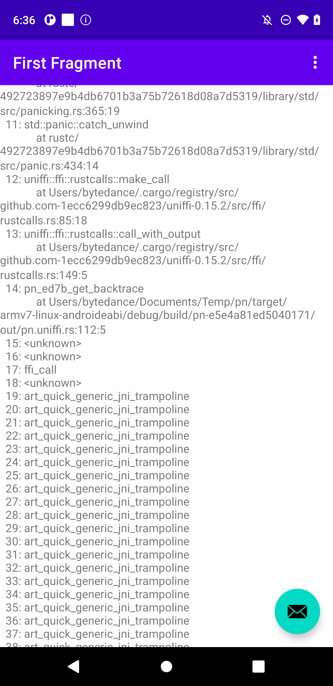
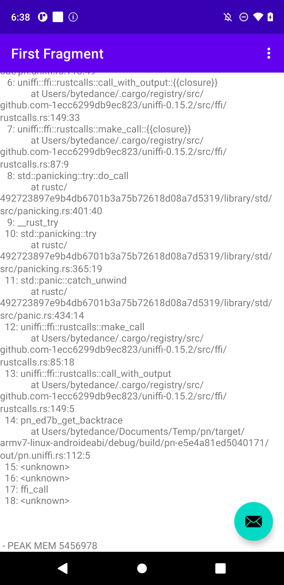

# backtrace_oom_demo

## What's this

This is an app demo to reproduce the bug I found in AOSP. When we call a function which uses `_Unwind_Backtrace` to generate stack backtrace in `armv7a` native `.so` via `JNI` when our app is not compiled to `.oat` file, we'll get a looping output pointing to `art_quick_generic_jni_trampoline + 42`. The deadloop will make our app `OOM` if we don't set limit to the depth of backtrace in rust when using `backtrace::Backtrace::new()` to capture a new backtrace.

You can reproduce the bug easily by downloading [demo apk](https://github.com/name1e5s/backtrace_oom_demo/releases/download/demo/app-debug.apk) and install it on any arm/aarch android device.

When you find the following output in your device, you've successfully reproduce the bug:


If your device shows a normal output like...



Try `adb shell cmd package compile --reset com.example.myapplication` and re-open the app.


Since `art_quick_generic_jni_trampoline` is only used by art's interpret mode, we can bypass this bug by force our device to compile the app:

```
adb shell cmd package compile -m speed -f com.example.myapplication
```

## How to build

Open `app/` folder in Android Studio and click `run`. 
The `pn/` folder contains source code of the native binady `libpn.so` in the android project. You can build the binary using `cargo dinghy`(https://github.com/sonos/dinghy), and move the target binary to `app/app/src/main/jniLibs/<arch>` to use them.

## Affected Android Version

Android 7.0 ~ master